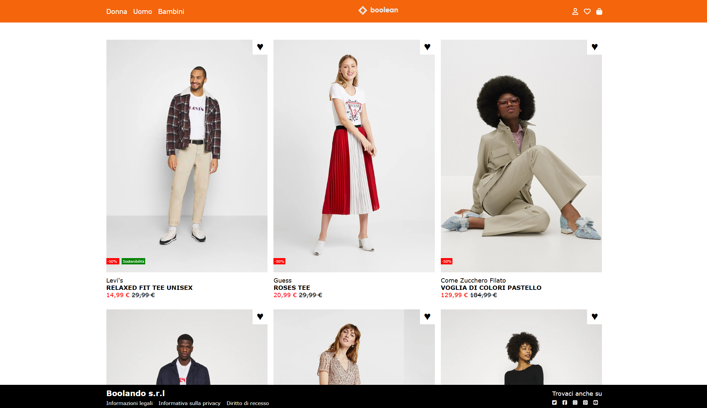
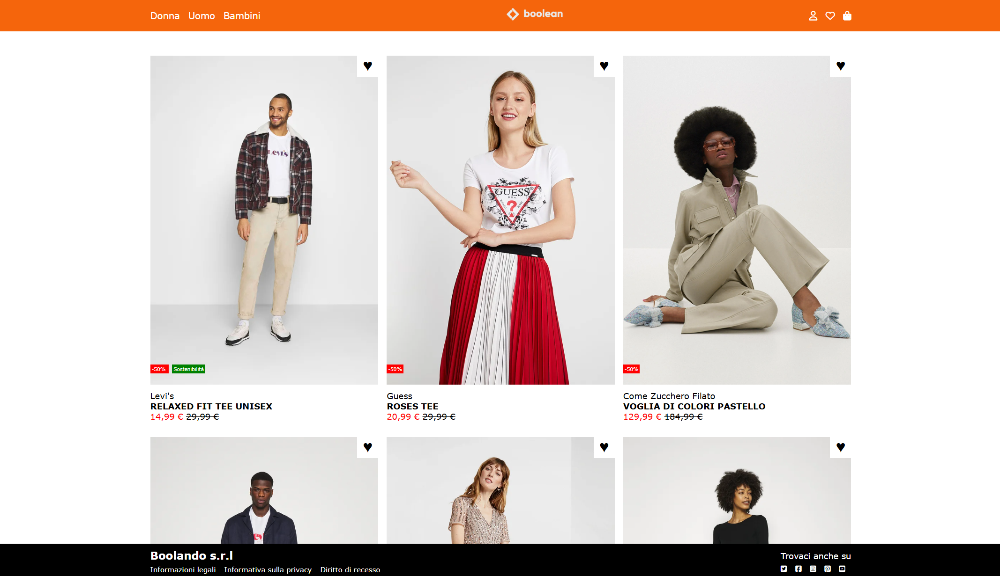

  

<h1 align="center">Boolando</h1>

Pagina HTML/CSS che riproduce un layout e-commerce ispirato a Zalando,
con griglia di prodotti, effetti hover sulle immagini e intestazione fissa.

## Obiettivo

- Riprodurre il layout fornito nello screenshot, con struttura a griglia di prodotti
- Mostrare per ogni prodotto due immagini:
  - la prima visibile di default
  - la seconda visibile al passaggio del mouse sulla card (effetto hover)
- Realizzare:
  - un header in posizione fixed
  - un footer con le informazioni finali del sito
- Applicare e combinare le regole HTML/CSS viste fino a questo punto
  (layout, griglia, tipografia, spaziature, effetti hover, ecc.)

## Anteprima

### Layout standard

### Stato hover su un prodotto

## Tecnologie utilizzate

- HTML5  
- CSS3
